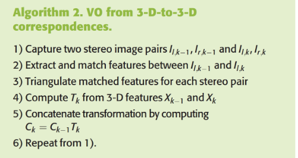

#Flowchart pipeline

    I: À chaque pas:
        1: Pour chaque image:
            A: Détection des keypoints
            B: Sélection des keypoints pertinents
        2: Appariement des keypoints dans les deux images
        3: Appariement des keypoints dans les images t et t-1
        4: Calcul de la pose relative au dernier pas
        5: Calcul de la pose absolue 
    II: Fermeture de la boucle
    III: Vérification de la trajectoire calculée

fast stereo visual odometry based on lk optical flow and ORB-SLAM 2